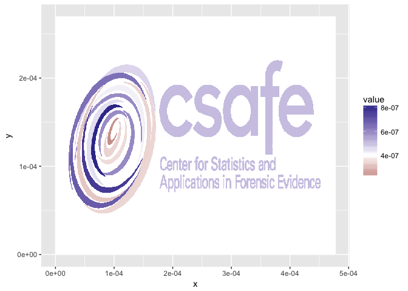

[](https://travis-ci.org/heike/x3ptools)

<!--[](https://cran.r-project.org/package=x3ptools) [](http://www.r-pkg.org/pkg/x3ptools) -->


<!--[](https://cran.r-project.org/package=x3ptools)-->


# Installation

A stable version of `x3ptools` is available on CRAN:


```r
install.packages("x3ptools")
```

The development version is available from Github:


```r
# install.packages("devtools")
devtools::install_github("heike/x3ptools", build_vignettes = TRUE)
```

## Usage

### Reading and writing x3p files

`read_x3p` and `write_x3p` are the two functions allows us to read x3p files and write to x3p files.

```r
library(x3ptools)
logo <- read_x3p(system.file("csafe-logo.x3p", package="x3ptools"))
names(logo)
```

```
## [1] "header.info"    "surface.matrix" "feature.info"   "general.info"  
## [5] "matrix.info"
```

### Visualizing x3p objects

The function `image_x3p` uses `rgl` to render a 3d object in a separate window. The user can then interact with the 3d surface (zoom and rotate). In case a file name is specified in the function call the resulting surface is saved in a file (the extension determines the actual file format of the image).


```r
image_x3p(logo, file=NULL)
```


### Casting between data types

The functions `x3p_to_df` and `df_to_x3p` allow casting between an x3p format and an x-y-z data set:

```r
logo_df <- x3p_to_df(logo)
head(logo_df)
```

```
##           x          y value
## 1 0.000e+00 0.00026961 4e-07
## 2 6.450e-07 0.00026961 4e-07
## 3 1.290e-06 0.00026961 4e-07
## 4 1.935e-06 0.00026961 4e-07
## 5 2.580e-06 0.00026961 4e-07
## 6 3.225e-06 0.00026961 4e-07
```
When converting from the x3p format to a data frame, the values from the surface matrix are interpreted as heights (saved as `value`) on an x-y grid. The dimension of the matrix sets the number of different x and y levels,  the information in `header.info` allows us to scale the levels to the measured quantities. 
Similarly, when moving from a data frame to a surface matrix, the assumption is that measurements are taken on an equi-spaced and complete grid of x-y values. The information on the  resolution (i.e. the spacing between consecutive x and y locations) is saved in form of the header info, which is added to the list. 
General info and feature info can not be extracted from the measurements, but have to be recorded with other means.

Once data is in a regular data frame, we can use our regular means to visualize these raster images, e.g. using `ggplot2`:


```r
library(ggplot2)
logo_df %>% ggplot(aes( x= x, y=y, fill= value)) +
  geom_tile() +
  scale_fill_gradient2(midpoint=4e-7)
```

<!-- -->

### Elementary operations

#### Rotation and Transposition

`rotate_x3p` rotates an x3p image in steps of 90 degrees, `transpose_x3p` transposes the surface matrix of an image and updates the corresponding meta information.

#### Sampling

`sample_x3p` allows to sub-sample an x3p object to get a lower resolution image.
In `sample_x3p` we need to set a sampling factor. A sample factor `m` of 2 means that we only use every 2nd value of the surface matrix, `m` of 5 means, we only use every fifth value:


```r
dim(logo$surface.matrix)
```

```
## [1] 741 419
```

```r
logo_sample <- sample_x3p(logo, m=5)
dim(logo_sample$surface.matrix)
```

```
## [1] 149  84
```
